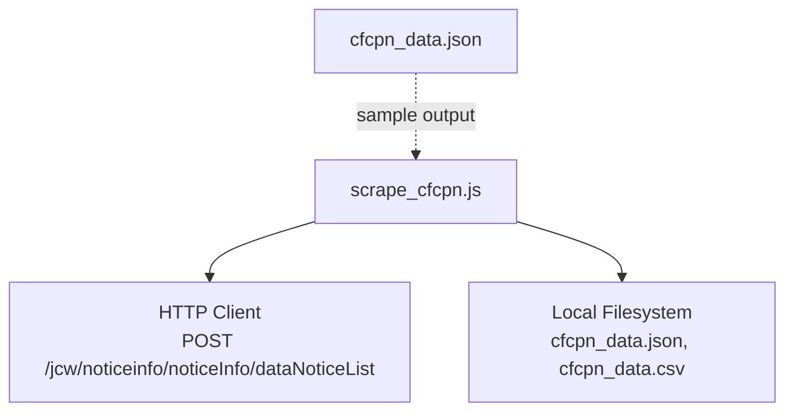
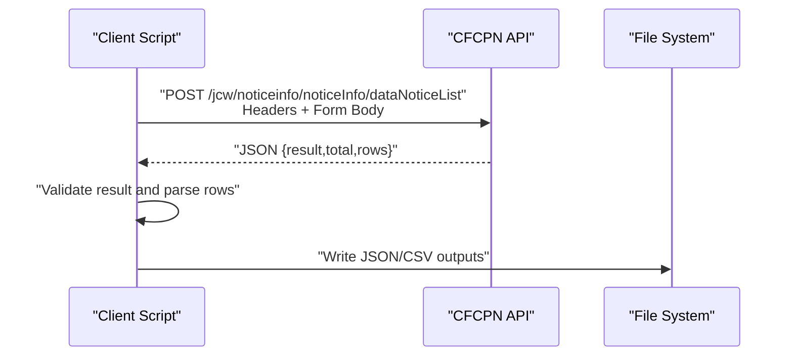
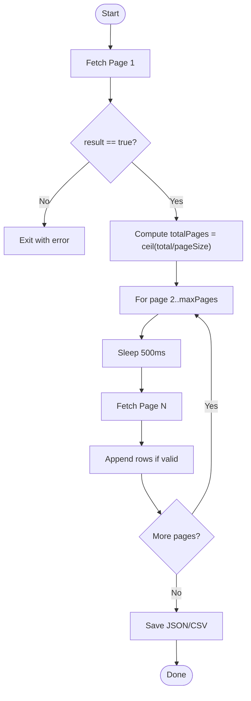
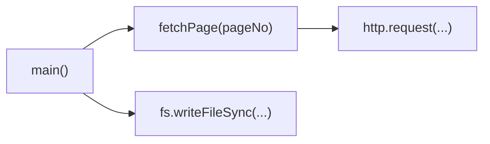

# API Reference

<cite>
**Referenced Files in This Document**
- [scrape_cfcpn.js](file://scrape_cfcpn.js)
- [cfcpn_data.json](file://cfcpn_data.json)
</cite>

## Table of Contents
1. [Introduction](#introduction)
2. [Project Structure](#project-structure)
3. [Core Components](#core-components)
4. [Architecture Overview](#architecture-overview)
5. [Detailed Component Analysis](#detailed-component-analysis)
6. [Dependency Analysis](#dependency-analysis)
7. [Performance Considerations](#performance-considerations)
8. [Troubleshooting Guide](#troubleshooting-guide)
9. [Conclusion](#conclusion)
10. [Appendices](#appendices)

## Introduction
This document provides an API reference for the CFCPN (金采网) procurement notice listing endpoint used by the provided scraper. It documents the POST request, required headers, all request parameters, response schema, example HTTP cycles, rate limiting guidance, error handling, and client integration tips. The information is derived from the implementation in the repository’s scraping script and a sample output file.

## Project Structure
The repository contains:
- A Node.js script that performs HTTP requests to the CFCPN API and writes results to JSON/CSV files.
- A sample JSON output file demonstrating the structure of scraped data.

**Diagram sources**
- [scrape_cfcpn.js:15-70](file://scrape_cfcpn.js#L15-L70)
- [cfcpn_data.json:1-10](file://cfcpn_data.json#L1-L10)

**Section sources**
- [scrape_cfcpn.js:1-181](file://scrape_cfcpn.js#L1-L181)
- [cfcpn_data.json:1-557](file://cfcpn_data.json#L1-L557)

## Core Components
- Endpoint: POST http://www.cfcpn.com/jcw/noticeinfo/noticeInfo/dataNoticeList
- Request body: application/x-www-form-urlencoded with pagination and filter fields
- Response: JSON object containing result flag, total count, and rows array of notices

Key behaviors observed in the implementation:
- Pagination via pageNo and pageSize (pageSize fixed at 10).
- Filtering via multiple optional fields including searchType, searchContent, searchNoticeType, searchText, region, commonLabel1, commonLabel2, beginPublishTime, endPublishTime, searchVal, searchPurId, labelAllId.
- Required headers include Content-Type, User-Agent, and Referer.
- Rate limiting: 500ms delay between requests.

**Section sources**
- [scrape_cfcpn.js:21-70](file://scrape_cfcpn.js#L21-L70)
- [scrape_cfcpn.js:116-131](file://scrape_cfcpn.js#L116-L131)

## Architecture Overview
The scraper constructs a form-encoded POST request, sends it to the CFCPN server, parses the JSON response, and persists results locally.

**Diagram sources**
- [scrape_cfcpn.js:41-70](file://scrape_cfcpn.js#L41-L70)
- [scrape_cfcpn.js:135-172](file://scrape_cfcpn.js#L135-L172)

## Detailed Component Analysis

### Endpoint and Authentication
- Method: POST
- URL: http://www.cfcpn.com/jcw/noticeinfo/noticeInfo/dataNoticeList
- Authentication: No explicit authentication mechanism is implemented in the script; no cookies or tokens are set. Requests rely on standard browser-like headers.

**Section sources**
- [scrape_cfcpn.js:15-52](file://scrape_cfcpn.js#L15-L52)

### Request Headers
- Content-Type: application/x-www-form-urlencoded
- User-Agent: Mozilla/5.0 (Windows NT 10.0; Win64; x64) AppleWebKit/537.36
- Referer: http://www.cfcpn.com/jcw/sys/index/goUrl?url=modules/sys/login/list&column=cggg
- Content-Length: automatically computed based on body length

Notes:
- The Referer header points to a login/list page with column=cggg, aligning with the column parameter value used in requests.

**Section sources**
- [scrape_cfcpn.js:47-52](file://scrape_cfcpn.js#L47-L52)

### Request Parameters (Form-Encoded)
All parameters are sent as part of the form body. Values are strings.

- pageNo: integer page number (stringified)
- pageSize: fixed at 10 (stringified)
- column: set to 'cggg'
- searchType: default '选择分类'
- searchContent: empty string by default
- searchNoticeType: default '1'
- searchText: empty string by default
- region: empty string by default
- commonLabel1: empty string by default
- commonLabel2: empty string by default
- beginPublishTime: empty string by default
- endPublishTime: empty string by default
- searchVal: empty string by default
- searchPurId: empty string by default
- labelAllId: empty string by default

Behavior:
- pageNo controls pagination.
- pageSize is constant at 10.
- Filters can be applied using the search* and label* fields.

**Section sources**
- [scrape_cfcpn.js:23-39](file://scrape_cfcpn.js#L23-L39)

### Response Schema
The server returns a JSON object with the following top-level fields:
- result: boolean indicating success
- total: number of total records available
- rows: array of procurement notice objects

Each row object includes fields such as:
- id: string identifier
- noticeTitle: title of the notice
- publishTime: timestamp string
- userName: purchaser name
- purchaseTypeLable: procurement method label
- area: region
- labelAllId: category path
- yxCategoryNames: tags
- noticeSource: source link or name

Additional metadata may be present in responses; the scraper uses result, total, and rows.

Example usage in the script:
- Checks firstPage.result before proceeding
- Reads firstPage.total to compute totalPages
- Aggregates firstPage.rows across pages

**Section sources**
- [scrape_cfcpn.js:94-103](file://scrape_cfcpn.js#L94-L103)
- [scrape_cfcpn.js:113-131](file://scrape_cfcpn.js#L113-L131)

### Example HTTP Request Cycle
A minimal successful request cycle:

Request:
- Method: POST
- Host: www.cfcpn.com
- Path: /jcw/noticeinfo/noticeInfo/dataNoticeList
- Headers:
  - Content-Type: application/x-www-form-urlencoded
  - User-Agent: Mozilla/5.0 (Windows NT 10.0; Win64; x64) AppleWebKit/537.36
  - Referer: http://www.cfcpn.com/jcw/sys/index/goUrl?url=modules/sys/login/list&column=cggg
- Body (form-encoded):
  - pageNo=1&pageSize=10&column=cggg&searchType=%E9%80%89%E6%8B%A9%E5%88%86%E7%B1%BB&searchContent=&searchNoticeType=1&searchText=&region=&commonLabel1=&commonLabel2=&beginPublishTime=&endPublishTime=&searchVal=&searchPurId=&labelAllId=

Response:
- Status: 200 OK
- Body: JSON with result=true, total=N, rows=[...]

Note:
- The exact values of search fields can be customized to filter results.
- The Referer must match the expected domain and path pattern.

**Section sources**
- [scrape_cfcpn.js:23-52](file://scrape_cfcpn.js#L23-L52)

### Example HTTP Error Responses
Potential issues handled by the client:
- Network errors: caught and reported
- JSON parsing errors: captured with raw payload snippet for debugging

Typical scenarios:
- Invalid or malformed response body leads to a parse error
- Unexpected status codes or empty bodies should be handled by the client

Recommendation:
- Always check HTTP status code and validate JSON before processing.

**Section sources**
- [scrape_cfcpn.js:55-70](file://scrape_cfcpn.js#L55-L70)

### Rate Limiting and Throttling
- The script enforces a 500ms delay between requests to avoid being blocked.
- For large-scale scraping, consider additional backoff strategies and jitter.

Guidelines:
- Maintain at least 500ms between requests.
- Implement exponential backoff on transient failures.
- Respect any server-side rate limits indicated by responses.

**Section sources**
- [scrape_cfcpn.js:73-76](file://scrape_cfcpn.js#L73-76)
- [scrape_cfcpn.js:116-118](file://scrape_cfcpn.js#L116-L118)

### Data Flow and Processing Logic
The scraper:
- Fetches page 1 to determine total count
- Computes total pages based on total and pageSize
- Iteratively fetches subsequent pages with delays
- Aggregates rows and writes to JSON and CSV

**Diagram sources**
- [scrape_cfcpn.js:94-131](file://scrape_cfcpn.js#L94-L131)
- [scrape_cfcpn.js:135-172](file://scrape_cfcpn.js#L135-L172)

**Section sources**
- [scrape_cfcpn.js:88-175](file://scrape_cfcpn.js#L88-L175)

## Dependency Analysis
External dependencies:
- Node.js built-in modules: http, fs, path
- External service: CFCPN API server

Internal relationships:
- fetchPage constructs and executes HTTP requests
- main orchestrates pagination, throttling, and persistence

**Diagram sources**
- [scrape_cfcpn.js:21-70](file://scrape_cfcpn.js#L21-L70)
- [scrape_cfcpn.js:88-175](file://scrape_cfcpn.js#L88-L175)

**Section sources**
- [scrape_cfcpn.js:11-18](file://scrape_cfcpn.js#L11-L18)
- [scrape_cfcpn.js:21-70](file://scrape_cfcpn.js#L21-L70)
- [scrape_cfcpn.js:88-175](file://scrape_cfcpn.js#L88-L175)

## Performance Considerations
- Fixed pageSize of 10 balances throughput and payload size.
- 500ms inter-request delay reduces risk of blocking but increases total time for large datasets.
- Consider batching or parallelism only if allowed by server policies; otherwise, sequential with delays is safer.
- Local I/O is performed once per run; ensure sufficient disk space for large exports.

[No sources needed since this section provides general guidance]

## Troubleshooting Guide
Common issues and remedies:
- JSON parse error: Indicates malformed response; inspect raw payload snippet and network logs.
- Empty rows: May indicate filters too restrictive or pagination reached end; verify pageNo and filters.
- Blocked requests: Increase delay beyond 500ms or rotate User-Agent/Referer carefully.
- Missing fields: Ensure you map response fields correctly; refer to sample output for field names.

Debugging tools:
- Log full request headers and body for reproduction.
- Capture and store raw response payloads on errors.
- Use network proxies or logging libraries to monitor traffic patterns.

**Section sources**
- [scrape_cfcpn.js:55-70](file://scrape_cfcpn.js#L55-L70)
- [scrape_cfcpn.js:94-103](file://scrape_cfcpn.js#L94-L103)

## Conclusion
The CFCPN notice listing API is accessed via a simple POST with form-encoded parameters and browser-like headers. The response provides paginated results with a consistent shape. Reliable integrations should implement robust error handling, respect rate limits, and validate responses before processing.

[No sources needed since this section summarizes without analyzing specific files]

## Appendices

### Appendix A: Complete Field Reference

Request Parameters (form-encoded):
- pageNo: integer page number
- pageSize: fixed at 10
- column: 'cggg'
- searchType: default '选择分类'
- searchContent: optional text
- searchNoticeType: default '1'
- searchText: optional text
- region: optional region filter
- commonLabel1: optional label
- commonLabel2: optional label
- beginPublishTime: optional start date
- endPublishTime: optional end date
- searchVal: optional value
- searchPurId: optional purchaser ID
- labelAllId: optional category ID

Required Headers:
- Content-Type: application/x-www-form-urlencoded
- User-Agent: Mozilla/5.0 (Windows NT 10.0; Win64; x64) AppleWebKit/537.36
- Referer: http://www.cfcpn.com/jcw/sys/index/goUrl?url=modules/sys/login/list&column=cggg

Response Fields:
- result: boolean
- total: number
- rows: array of notice objects with fields like id, noticeTitle, publishTime, userName, purchaseTypeLable, area, labelAllId, yxCategoryNames, noticeSource

**Section sources**
- [scrape_cfcpn.js:23-39](file://scrape_cfcpn.js#L23-L39)
- [scrape_cfcpn.js:47-52](file://scrape_cfcpn.js#L47-L52)
- [scrape_cfcpn.js:94-103](file://scrape_cfcpn.js#L94-L103)
- [cfcpn_data.json:1-10](file://cfcpn_data.json#L1-L10)

### Appendix B: Sample Output Structure
The sample output demonstrates:
- Top-level keys: scrapeTime, total, scraped, rows
- Each row includes id, title, publishTime, purchaser, method, region, category, tags, source

These fields correspond to mapped properties from the API response rows.

**Section sources**
- [cfcpn_data.json:1-10](file://cfcpn_data.json#L1-L10)