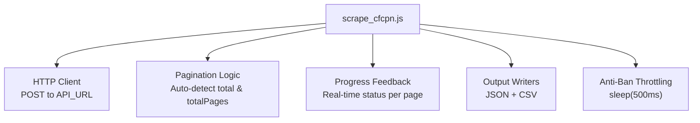
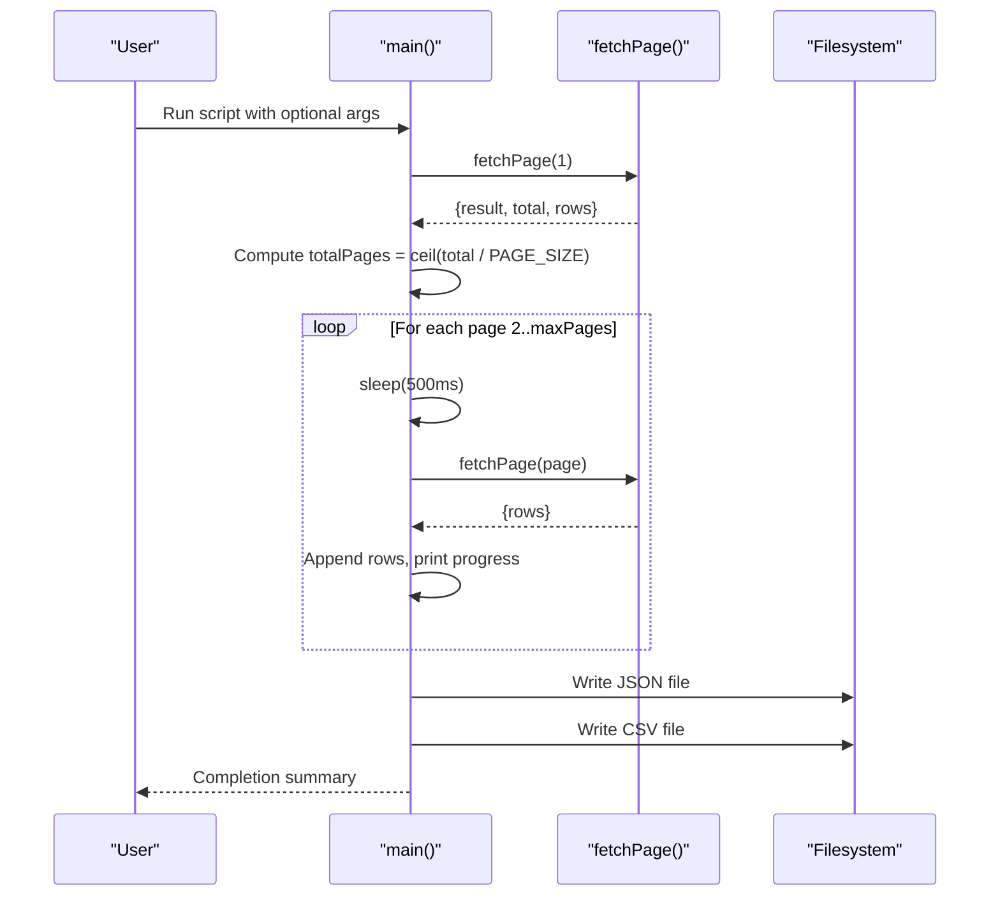
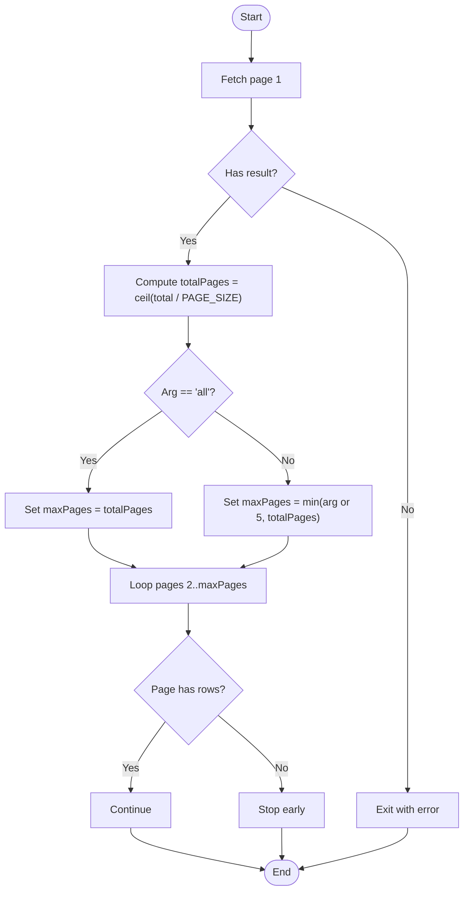
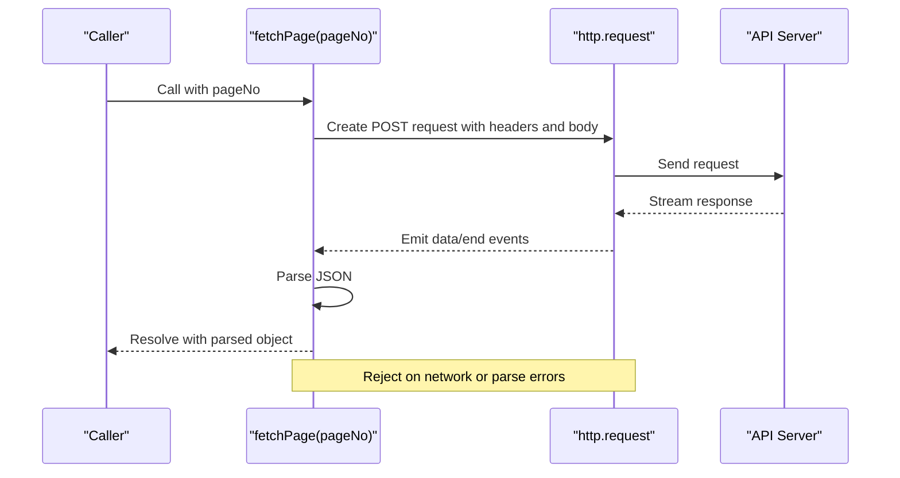
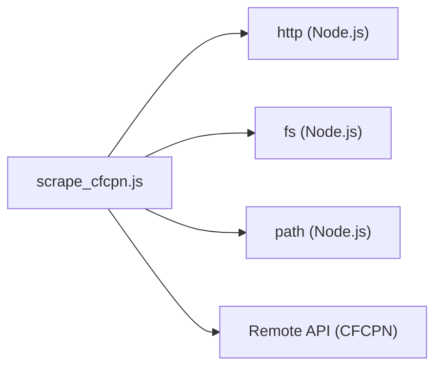

# Core Features

<cite>
**Referenced Files in This Document**
- [scrape_cfcpn.js](file://scrape_cfcpn.js)
</cite>

## Table of Contents
1. [Introduction](#introduction)
2. [Project Structure](#project-structure)
3. [Core Components](#core-components)
4. [Architecture Overview](#architecture-overview)
5. [Detailed Component Analysis](#detailed-component-analysis)
6. [Dependency Analysis](#dependency-analysis)
7. [Performance Considerations](#performance-considerations)
8. [Troubleshooting Guide](#troubleshooting-guide)
9. [Conclusion](#conclusion)

## Introduction
This document explains the core features of the CFCPN scraper implemented in a single Node.js script. It focuses on:
- Intelligent pagination that auto-detects total records and computes required pages
- Real-time progress feedback during scraping
- Dual-format output (JSON and CSV) generated simultaneously
- Anti-ban mechanism using request throttling
- Concrete examples from the codebase for fetchPage, main orchestration, and csvEscape
- Configuration options such as PAGE_SIZE and API_URL
- Error handling strategies and retry behavior

The goal is to make the implementation accessible to beginners while providing sufficient technical depth for experienced developers.

## Project Structure
The project consists of a single JavaScript file that contains all logic for HTTP requests, pagination, progress reporting, and file output. The script uses only built-in Node.js modules for networking and filesystem operations.

**Diagram sources**
- [scrape_cfcpn.js:15-18](file://scrape_cfcpn.js#L15-L18)
- [scrape_cfcpn.js:21-71](file://scrape_cfcpn.js#L21-L71)
- [scrape_cfcpn.js:74-76](file://scrape_cfcpn.js#L74-L76)
- [scrape_cfcpn.js:88-175](file://scrape_cfcpn.js#L88-L175)

**Section sources**
- [scrape_cfcpn.js:15-18](file://scrape_cfcpn.js#L15-L18)

## Core Components
- Configuration constants: API endpoint URL and page size
- HTTP client function to POST form data and parse JSON responses
- Sleep utility to throttle requests
- CSV escaping helper to ensure valid CSV formatting
- Main orchestrator that performs intelligent pagination, progress reporting, and dual-format output

Key configuration options:
- API_URL: Target endpoint for fetching notice lists
- PAGE_SIZE: Number of records per page
- OUTPUT_JSON and OUTPUT_CSV: Output file paths

Behavior highlights:
- Fetches page 1 first to determine total records and compute totalPages
- Supports command-line arguments to limit pages or scrape all
- Writes both JSON and CSV files after scraping completes
- Uses 500ms delay between requests to reduce risk of being blocked

**Section sources**
- [scrape_cfcpn.js:15-18](file://scrape_cfcpn.js#L15-L18)
- [scrape_cfcpn.js:21-71](file://scrape_cfcpn.js#L21-L71)
- [scrape_cfcpn.js:74-76](file://scrape_cfcpn.js#L74-L76)
- [scrape_cfcpn.js:79-86](file://scrape_cfcpn.js#L79-L86)
- [scrape_cfcpn.js:88-175](file://scrape_cfcpn.js#L88-L175)

## Architecture Overview
High-level flow:
- Entry point parses CLI arguments and initializes scraping
- First request retrieves metadata including total record count
- Loop iterates through remaining pages with throttling and progress updates
- On completion, writes JSON and CSV outputs

**Diagram sources**
- [scrape_cfcpn.js:88-175](file://scrape_cfcpn.js#L88-L175)
- [scrape_cfcpn.js:21-71](file://scrape_cfcpn.js#L21-L71)
- [scrape_cfcpn.js:74-76](file://scrape_cfcpn.js#L74-L76)

## Detailed Component Analysis

### Intelligent Pagination System
- Auto-detection: The script fetches page 1 first to obtain total records from the response.
- Page calculation: totalPages is computed as ceil(total / PAGE_SIZE).
- Argument-driven limits: If the argument is 'all', it scrapes totalPages; otherwise, it uses the provided number or defaults to 5, bounded by totalPages.
- Early termination: If a page returns no data, the loop stops early to avoid unnecessary requests.

**Diagram sources**
- [scrape_cfcpn.js:88-131](file://scrape_cfcpn.js#L88-L131)

**Section sources**
- [scrape_cfcpn.js:88-131](file://scrape_cfcpn.js#L88-L131)

### Progress Feedback Mechanism
- Real-time status: After each successful page fetch, the script prints the current page index, total target pages, and row count.
- Initial progress: Immediately after fetching page 1, it reports the first page’s completion.
- Error reporting: On failure or empty results, it logs warnings/errors and halts further processing.

Example references:
- Progress printing occurs within the main loop after each page fetch.
- Errors are logged with page context and message details.

**Section sources**
- [scrape_cfcpn.js:114-131](file://scrape_cfcpn.js#L114-L131)

### Dual-Format Output System (JSON and CSV)
- JSON output: Includes scrape timestamp, total records, scraped count, and mapped rows with selected fields.
- CSV output: Header row followed by one row per record, using UTF-8 with BOM for Excel compatibility.
- Field mapping: Both formats map source fields to consistent output names.

Implementation notes:
- JSON structure includes metadata and an array of normalized records.
- CSV uses a header string and maps each row via csvEscape to ensure proper quoting.

**Section sources**
- [scrape_cfcpn.js:136-172](file://scrape_cfcpn.js#L136-L172)

### Anti-Ban Mechanism (Request Throttling)
- Delay strategy: A fixed 500ms delay is applied before each subsequent request starting from page 2.
- Purpose: Reduces likelihood of being rate-limited or blocked by the target website.

References:
- The delay is implemented using a simple sleep function based on setTimeout.

**Section sources**
- [scrape_cfcpn.js:74-76](file://scrape_cfcpn.js#L74-L76)
- [scrape_cfcpn.js:117](file://scrape_cfcpn.js#L117)

### HTTP POST Request Handling (fetchPage)
- Method: POST to API_URL with form-encoded payload.
- Headers: Sets Content-Type, Content-Length, User-Agent, and Referer.
- Payload: Includes pageNo, pageSize, and various filter parameters.
- Response handling: Accumulates chunks, parses JSON, and resolves or rejects promises accordingly.

**Diagram sources**
- [scrape_cfcpn.js:21-71](file://scrape_cfcpn.js#L21-L71)

**Section sources**
- [scrape_cfcpn.js:21-71](file://scrape_cfcpn.js#L21-L71)

### CSV Escaping (csvEscape)
- Purpose: Ensures values containing commas, quotes, or newlines are properly quoted and escaped for CSV.
- Behavior: Returns empty string for null/undefined; wraps problematic values in double quotes and escapes internal quotes by doubling them.

Use cases:
- Applied to each field when building CSV rows to prevent malformed lines.

**Section sources**
- [scrape_cfcpn.js:79-86](file://scrape_cfcpn.js#L79-L86)
- [scrape_cfcpn.js:157-169](file://scrape_cfcpn.js#L157-L169)

### Main Orchestration (main)
Responsibilities:
- Parse CLI arguments to determine scraping scope
- Fetch initial page to discover total records
- Iterate through remaining pages with throttling and progress updates
- Write JSON and CSV outputs
- Provide completion summary

Control flow:
- Validates first-page response and exits on error
- Computes maxPages based on argument or default
- Aggregates rows across pages
- Persists outputs and prints final counts

**Section sources**
- [scrape_cfcpn.js:88-175](file://scrape_cfcpn.js#L88-L175)

## Dependency Analysis
Internal dependencies:
- http module for making HTTP requests
- fs and path modules for writing output files
- Built-in URLSearchParams for encoding POST payloads

External dependency:
- Remote API at API_URL

**Diagram sources**
- [scrape_cfcpn.js:11-18](file://scrape_cfcpn.js#L11-L18)
- [scrape_cfcpn.js:21-71](file://scrape_cfcpn.js#L21-L71)
- [scrape_cfcpn.js:136-172](file://scrape_cfcpn.js#L136-L172)

**Section sources**
- [scrape_cfcpn.js:11-18](file://scrape_cfcpn.js#L11-L18)

## Performance Considerations
- Request throttling: Fixed 500ms delay reduces server load and avoids bans but increases total runtime.
- Memory usage: All rows are accumulated in memory before writing; consider streaming for very large datasets.
- I/O efficiency: Writing JSON and CSV sequentially is straightforward; for extremely large outputs, consider chunked writes.
- Network resilience: Current implementation does not implement retries; transient failures stop the process.

[No sources needed since this section provides general guidance]

## Troubleshooting Guide
Common issues and strategies:
- Empty or invalid response: The script checks for a result flag on the first page and exits with an error if missing.
- JSON parsing errors: Wrapped in try/catch with detailed messages including raw snippet for debugging.
- Network errors: Rejected by the HTTP request promise; caught in the main loop with logging and early exit.
- Missing data on a page: Detected and causes early termination to avoid infinite loops.

Recommendations:
- Add retry logic with exponential backoff for transient network errors.
- Implement graceful degradation if a page fails (e.g., skip and continue).
- Validate response schema before accessing fields like total and rows.

**Section sources**
- [scrape_cfcpn.js:96-99](file://scrape_cfcpn.js#L96-L99)
- [scrape_cfcpn.js:59-63](file://scrape_cfcpn.js#L59-L63)
- [scrape_cfcpn.js:118-131](file://scrape_cfcpn.js#L118-L131)

## Conclusion
The CFCPN scraper implements a robust yet simple workflow:
- Intelligent pagination driven by server-provided totals
- Clear real-time progress feedback
- Dual-format outputs suitable for analysis and spreadsheet use
- Anti-ban throttling to maintain stability
- Straightforward error handling with informative messages

For production use, consider adding retries, streaming writes, and more resilient error recovery to handle large-scale scraping scenarios.