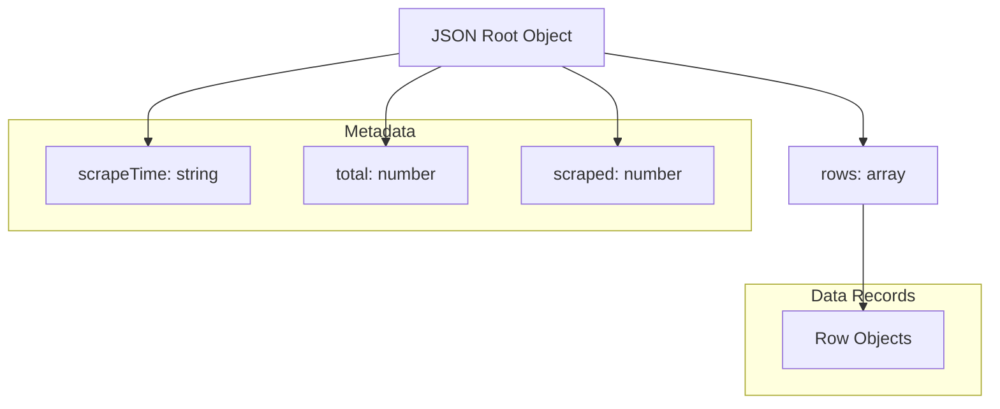
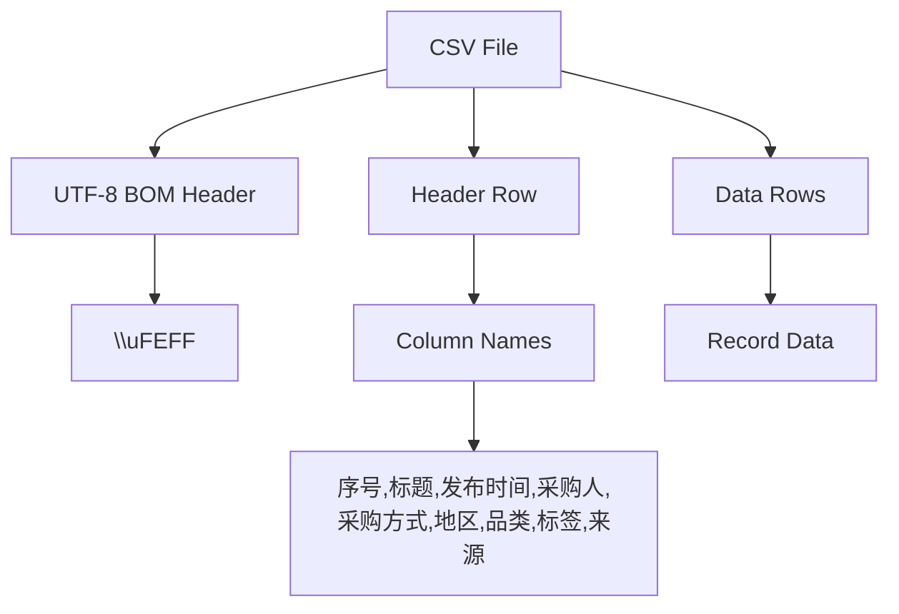
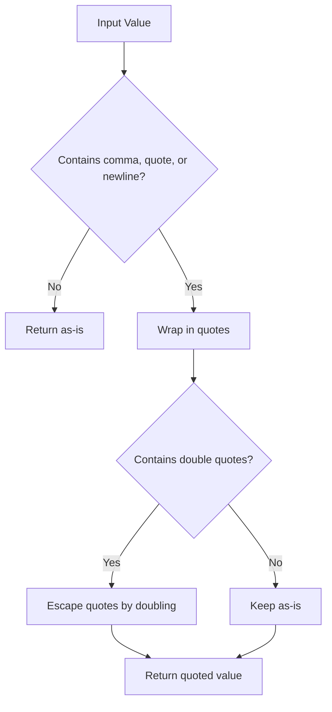
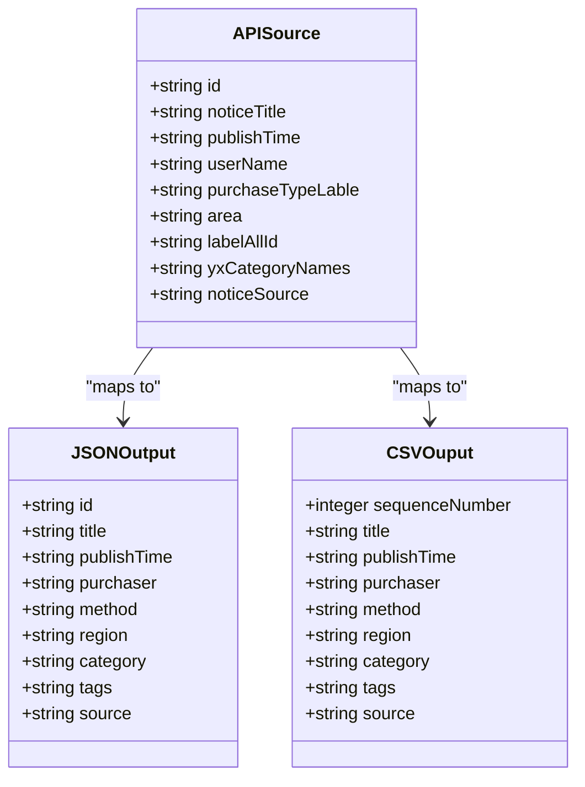
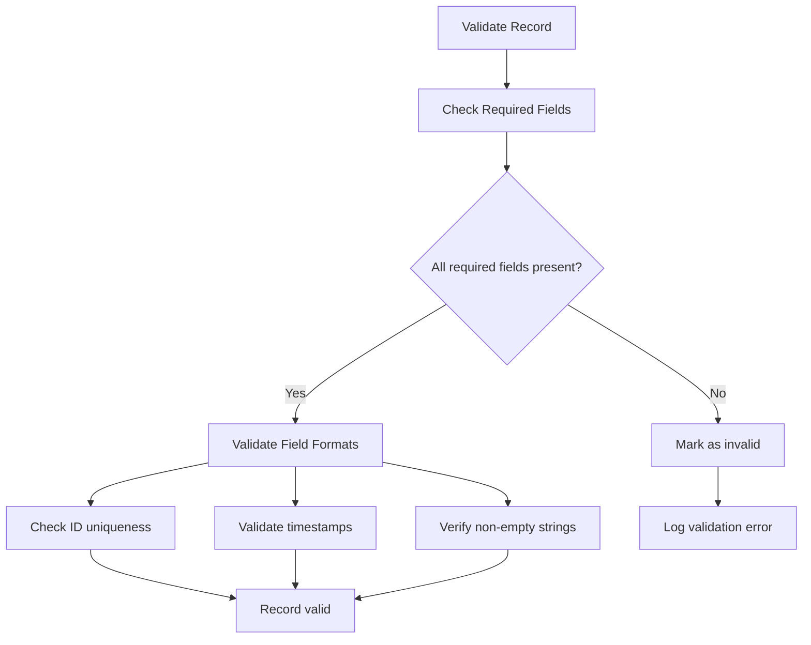
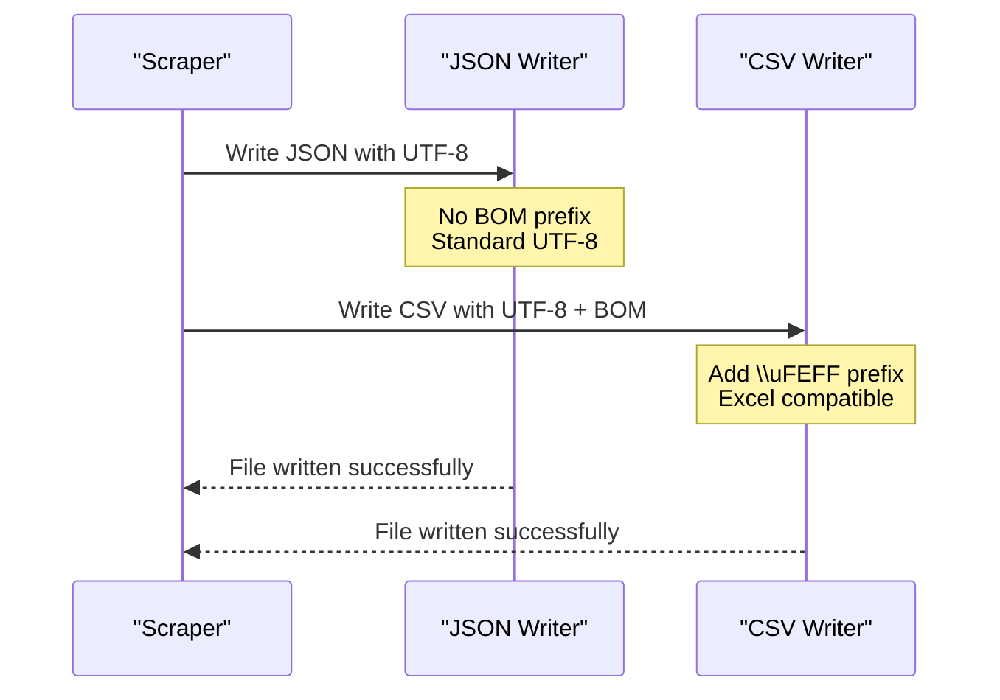
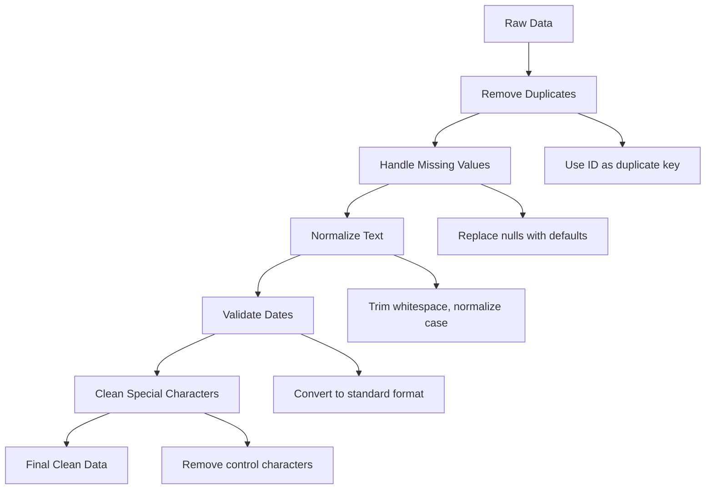

# Data Formats

<cite>
**Referenced Files in This Document**
- [scrape_cfcpn.js](file://scrape_cfcpn.js)
</cite>

## Table of Contents
1. [Introduction](#introduction)
2. [JSON Output Format](#json-output-format)
3. [CSV Output Format](#csv-output-format)
4. [Field Definitions](#field-definitions)
5. [Data Validation Rules](#data-validation-rules)
6. [Character Encoding](#character-encoding)
7. [Parsing Examples](#parsing-examples)
8. [Data Quality Considerations](#data-quality-considerations)
9. [Troubleshooting Guide](#troubleshooting-guide)
10. [Conclusion](#conclusion)

## Introduction

The CFCPN (China Financial Procurement Network) scraper generates structured data outputs in both JSON and CSV formats for procurement notices. The scraper extracts information from the CFCPN API and transforms it into standardized formats suitable for data analysis, reporting, and integration with other systems.

This document provides comprehensive specifications for both output formats, including field definitions, validation rules, encoding considerations, and practical examples for parsing and processing the data.

## JSON Output Format

The JSON output provides a structured representation of scraped procurement notice data with metadata and detailed record information.

### Root Structure



**Diagram sources**
- [scrape_cfcpn.js:136-151](file://scrape_cfcpn.js#L136-L151)

### Metadata Fields

| Field | Type | Description | Example |
|-------|------|-------------|---------|
| `scrapeTime` | string | ISO 8601 timestamp when scraping was performed | `"2024-01-15T10:30:00.000Z"` |
| `total` | number | Total number of records available in the source system | `145000` |
| `scraped` | number | Number of records actually scraped in this run | `50` |
| `rows` | array | Array of procurement notice objects | `[...]` |

### Row Object Structure

Each object in the `rows` array represents a single procurement notice with the following fields:

| Field | Type | Source Field | Description |
|-------|------|--------------|-------------|
| `id` | string/number | `row.id` | Unique identifier for the procurement notice |
| `title` | string | `row.noticeTitle` | Title of the procurement notice |
| `publishTime` | string | `row.publishTime` | Publication timestamp of the notice |
| `purchaser` | string | `row.userName` | Name of the purchasing organization |
| `method` | string | `row.purchaseTypeLable` | Procurement method or type |
| `region` | string | `row.area` | Geographic region or location |
| `category` | string | `row.labelAllId` | Category identifier code |
| `tags` | string | `row.yxCategoryNames` | Comma-separated category tags |
| `source` | string | `row.noticeSource` | Source system or department |

**Section sources**
- [scrape_cfcpn.js:136-151](file://scrape_cfcpn.js#L136-L151)

## CSV Output Format

The CSV output provides a tabular format optimized for spreadsheet applications and data analysis tools.

### File Structure



**Diagram sources**
- [scrape_cfcpn.js:155-171](file://scrape_cfcpn.js#L155-L171)

### Header Row Definition

The CSV file uses Chinese column headers for better readability in Excel:

| Column Index | Header Name | English Translation | Data Type |
|--------------|-------------|---------------------|-----------|
| 1 | 序号 | Sequence Number | Integer |
| 2 | 标题 | Title | String |
| 3 | 发布时间 | Publish Time | String |
| 4 | 采购人 | Purchaser | String |
| 5 | 采购方式 | Purchase Method | String |
| 6 | 地区 | Region | String |
| 7 | 品类 | Category | String |
| 8 | 标签 | Tags | String |
| 9 | 来源 | Source | String |

### Data Escaping Rules

The CSV implementation follows RFC 4180 standards with specific handling for special characters:



**Diagram sources**
- [scrape_cfcpn.js:78-86](file://scrape_cfcpn.js#L78-86)

**Section sources**
- [scrape_cfcpn.js:78-86](file://scrape_cfcpn.js#L78-86)
- [scrape_cfcpn.js:155-171](file://scrape_cfcpn.js#L155-L171)

## Field Definitions

### Complete Field Mapping

The scraper performs field mapping from the API response to the output format:



**Diagram sources**
- [scrape_cfcpn.js:140-150](file://scrape_cfcpn.js#L140-L150)
- [scrape_cfcpn.js:157-168](file://scrape_cfcpn.js#L157-L168)

### Field Specifications

#### Core Identification Fields

| Field | Description | Constraints | Examples |
|-------|-------------|-------------|----------|
| `id` | Unique notice identifier | Non-empty, unique per notice | `"1234567890"` |
| `title` | Notice title | Non-empty string | `"Government Procurement Notice #123"` |

#### Temporal Fields

| Field | Description | Format | Examples |
|-------|-------------|--------|----------|
| `publishTime` | Publication timestamp | ISO 8601 or similar | `"2024-01-15 10:30:00"` |

#### Organizational Fields

| Field | Description | Examples |
|-------|-------------|----------|
| `purchaser` | Purchasing organization name | `"Beijing Municipal Government"` |
| `source` | Source department or system | `"Finance Department"` |

#### Classification Fields

| Field | Description | Examples |
|-------|-------------|----------|
| `method` | Procurement method/type | `"Open Tendering"` |
| `region` | Geographic location | `"Beijing, China"` |
| `category` | Category identifier code | `"C010101"` |
| `tags` | Comma-separated category names | `"IT Equipment, Software, Hardware"` |

**Section sources**
- [scrape_cfcpn.js:140-150](file://scrape_cfcpn.js#L140-L150)
- [scrape_cfcpn.js:157-168](file://scrape_cfcpn.js#L157-L168)

## Data Validation Rules

### Required Fields

All core fields should be validated for presence and basic format compliance:



### Null Value Handling

The scraper implements null-safe operations:

- **CSV Processing**: Empty values are converted to empty strings using the `csvEscape` function
- **JSON Processing**: Fields are mapped directly from source, preserving null values if present
- **Sequence Numbers**: Automatically generated for CSV output starting from 1

### Character Encoding

- **JSON**: UTF-8 encoded without BOM
- **CSV**: UTF-8 encoded with BOM (`\uFEFF`) for Excel compatibility
- **Special Characters**: Properly escaped according to CSV standards

**Section sources**
- [scrape_cfcpn.js:78-86](file://scrape_cfcpn.js#L78-86)
- [scrape_cfcpn.js:152](file://scrape_cfcpn.js#L152)
- [scrape_cfcpn.js:170-171](file://scrape_cfcpn.js#L170-L171)

## Character Encoding

### UTF-8 Implementation

The scraper ensures proper character encoding across both output formats:



**Diagram sources**
- [scrape_cfcpn.js:152](file://scrape_cfcpn.js#L152)
- [scrape_cfcpn.js:170-171](file://scrape_cfcpn.js#L170-L171)

### Encoding Specifications

| Format | Encoding | BOM | Excel Compatibility | Notes |
|--------|----------|-----|-------------------|-------|
| JSON | UTF-8 | No | Good | Standard JSON format |
| CSV | UTF-8 | Yes | Excellent | Includes BOM for proper display |

**Section sources**
- [scrape_cfcpn.js:152](file://scrape_cfcpn.js#L152)
- [scrape_cfcpn.js:170-171](file://scrape_cfcpn.js#L170-L171)

## Parsing Examples

### Python - JSON Processing

```python
import json

with open('cfcpn_data.json', 'r', encoding='utf-8') as f:
    data = json.load(f)
    
print(f"Scraped at: {data['scrapeTime']}")
print(f"Total available: {data['total']}")
print(f"Records scraped: {data['scraped']}")

for row in data['rows']:
    print(f"ID: {row['id']}, Title: {row['title']}")
```

### Python - CSV Processing

```python
import csv

with open('cfcpn_data.csv', 'r', encoding='utf-8-sig') as f:
    reader = csv.DictReader(f)
    for row in reader:
        print(f"Title: {row['标题']}, Purchaser: {row['采购人']}")
```

### JavaScript - JSON Processing

```javascript
const fs = require('fs');
const data = JSON.parse(fs.readFileSync('cfcpn_data.json', 'utf8'));

console.log(`Scraped at: ${data.scrapeTime}`);
console.log(`Records: ${data.scraped}`);

data.rows.forEach(row => {
    console.log(`${row.id}: ${row.title}`);
});
```

### JavaScript - CSV Processing

```javascript
const fs = require('fs');
const content = fs.readFileSync('cfcpn_data.csv', 'utf8');
const lines = content.split('\n').slice(1); // Skip header

lines.forEach(line => {
    const columns = line.split(',');
    console.log(`Title: ${columns[1]}, Purchaser: ${columns[3]}`);
});
```

### Java - JSON Processing

```java
import com.fasterxml.jackson.databind.ObjectMapper;
import java.io.File;

ObjectMapper mapper = new ObjectMapper();
JsonNode root = mapper.readTree(new File("cfcpn_data.json"));

System.out.println("Scraped at: " + root.get("scrapeTime").asText());
System.out.println("Records: " + root.get("scraped").asInt());
```

### Java - CSV Processing

```java
import java.nio.file.Files;
import java.nio.file.Paths;
import java.util.List;

List<String> lines = Files.readAllLines(Paths.get("cfcpn_data.csv"), 
    java.nio.charset.StandardCharsets.UTF_8);
// Skip BOM and header
for (String line : lines.subList(1, lines.size())) {
    String[] columns = line.split(",");
    System.out.println("Title: " + columns[1]);
}
```

**Section sources**
- [scrape_cfcpn.js:136-151](file://scrape_cfcpn.js#L136-L151)
- [scrape_cfcpn.js:155-171](file://scrape_cfcpn.js#L155-L171)

## Data Quality Considerations

### Common Data Issues

1. **Missing Values**: Some API fields may be null or empty
2. **Inconsistent Formatting**: Timestamps and text formatting may vary
3. **Duplicate Records**: Potential duplicates if pagination fails
4. **Encoding Problems**: Special characters in titles or descriptions
5. **Truncation**: Long text fields may be truncated by the API

### Data Cleaning Recommendations



### Quality Metrics

Track these metrics during data processing:

- **Completeness**: Percentage of non-null required fields
- **Uniqueness**: Count of duplicate IDs
- **Validity**: Percentage of records passing validation rules
- **Consistency**: Uniformity of date formats and text encoding

**Section sources**
- [scrape_cfcpn.js:78-86](file://scrape_cfcpn.js#L78-86)

## Troubleshooting Guide

### Common Issues and Solutions

#### JSON Parse Errors
- **Symptom**: Error message containing "JSON parse error"
- **Cause**: Malformed API response or network issues
- **Solution**: Retry request, check network connectivity

#### Empty Results
- **Symptom**: Zero rows scraped despite successful API calls
- **Cause**: API changes, authentication issues, or filtering parameters
- **Solution**: Verify API endpoint, check authentication, review request parameters

#### CSV Display Issues in Excel
- **Symptom**: Garbled characters or incorrect column separation
- **Cause**: Encoding problems or delimiter conflicts
- **Solution**: Ensure UTF-8 with BOM encoding, verify comma delimiters

#### Memory Issues with Large Datasets
- **Symptom**: Out of memory errors when scraping all pages
- **Cause**: Loading entire dataset into memory
- **Solution**: Process data in chunks, use streaming approaches

### Debug Information

The scraper provides progress logging:
- Page-by-page scraping status
- Error messages with context
- Final summary statistics

**Section sources**
- [scrape_cfcpn.js:93-131](file://scrape_cfcpn.js#L93-L131)
- [scrape_cfcpn.js:177-180](file://scrape_cfcpn.js#L177-L180)

## Conclusion

The CFCPN scraper produces well-structured data outputs in both JSON and CSV formats, providing comprehensive procurement notice information with proper metadata and field mappings. The implementation follows best practices for data encoding, escaping, and error handling.

Key features include:
- **Structured JSON output** with complete metadata and normalized field names
- **Excel-compatible CSV** with UTF-8 BOM encoding and proper escaping
- **Robust error handling** and progress tracking
- **Flexible configuration** for different scraping scenarios

Users should implement appropriate data validation and cleaning procedures when consuming these outputs, particularly for production environments where data quality is critical.