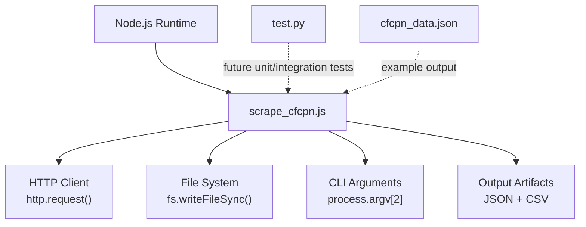
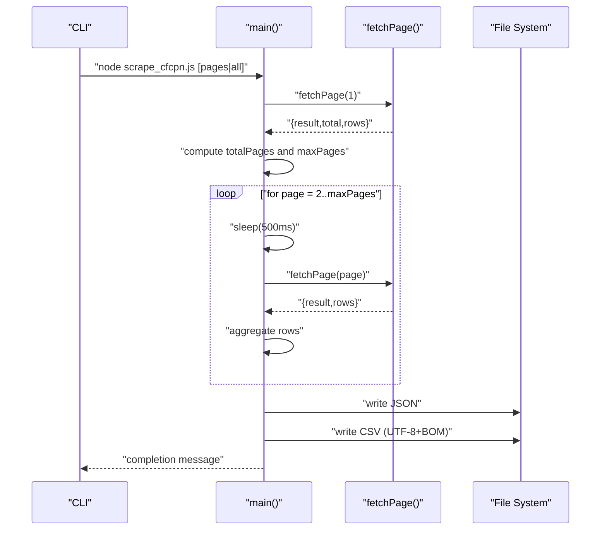
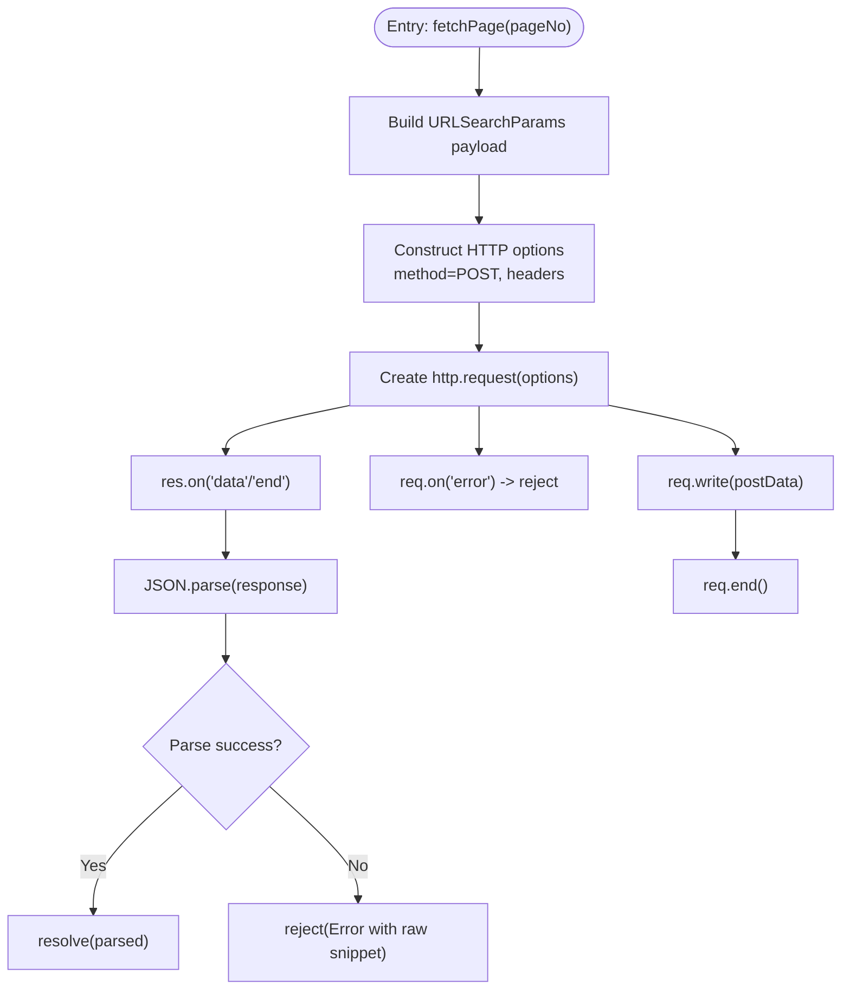
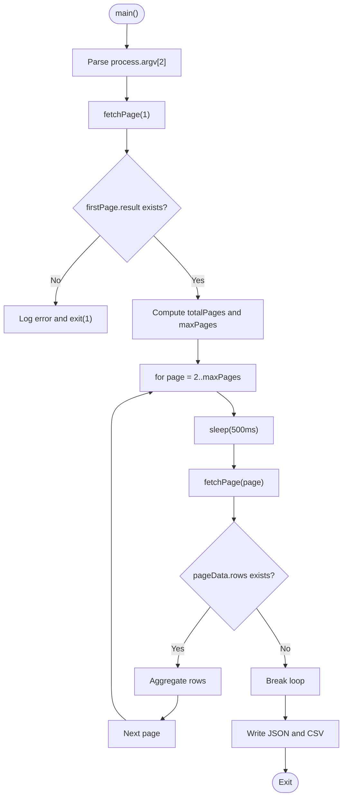
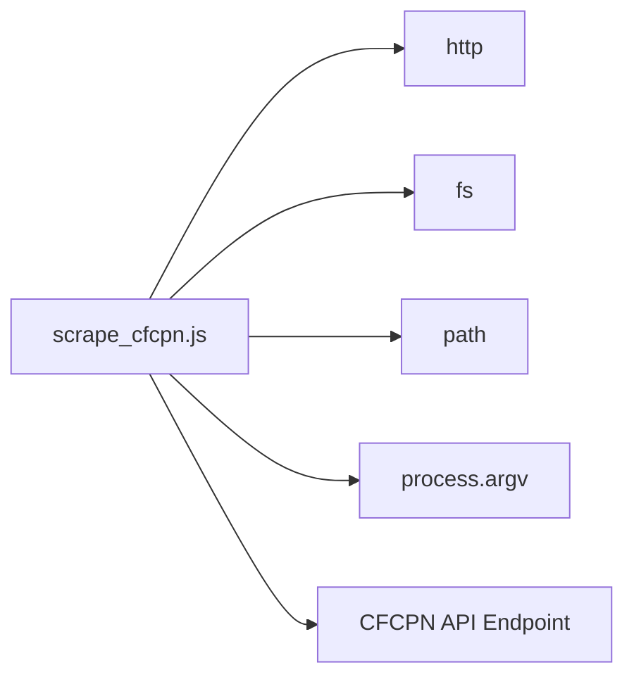

# Development Guide

<cite>
**Referenced Files in This Document**
- [scrape_cfcpn.js](file://scrape_cfcpn.js)
- [test.py](file://test.py)
- [cfcpn_data.json](file://cfcpn_data.json)
</cite>

## Table of Contents
1. [Introduction](#introduction)
2. [Project Structure](#project-structure)
3. [Core Components](#core-components)
4. [Architecture Overview](#architecture-overview)
5. [Detailed Component Analysis](#detailed-component-analysis)
6. [Dependency Analysis](#dependency-analysis)
7. [Performance Considerations](#performance-considerations)
8. [Troubleshooting Guide](#troubleshooting-guide)
9. [Conclusion](#conclusion)
10. [Appendices](#appendices)

## Introduction
This development guide explains how to extend and maintain the CFCPN scraper, a Node.js script that scrapes procurement notices from the CFCPN website. It documents the code structure, modular design patterns used within a single-file architecture, extension points for new output formats, retry logic, and database integration, testing approaches using the existing test.py file, debugging techniques, performance optimization strategies, code style conventions, deployment considerations across operating systems, and migration guidance when the target API changes.

The scraper:
- Posts paginated requests to an internal API endpoint
- Aggregates results into memory
- Writes outputs to JSON and CSV files
- Provides command-line arguments to control pagination

## Project Structure
The repository is intentionally minimal with a single-file implementation and supporting artifacts:
- scrape_cfcpn.js: Main scraper implementation (HTTP client, throttling, CSV escaping, orchestration)
- test.py: Placeholder for tests (currently empty)
- cfcpn_data.json: Example output artifact produced by the scraper

**Diagram sources**
- [scrape_cfcpn.js:11-18](file://scrape_cfcpn.js#L11-L18)
- [scrape_cfcpn.js:21-71](file://scrape_cfcpn.js#L21-L71)
- [scrape_cfcpn.js:88-181](file://scrape_cfcpn.js#L88-L181)

**Section sources**
- [scrape_cfcpn.js:1-181](file://scrape_cfcpn.js#L1-L181)
- [test.py:1-1](file://test.py#L1-L1)
- [cfcpn_data.json:1-200](file://cfcpn_data.json#L1-L200)

## Core Components
This section summarizes the primary functions and their responsibilities:

- fetchPage(pageNo): Performs HTTP POST requests to the CFCPN API with form-encoded parameters, parses JSON responses, and returns data rows or rejects on errors.
- sleep(ms): Returns a Promise that resolves after a specified delay; used to throttle requests and avoid rate limiting.
- csvEscape(val): Safely escapes values for CSV output, handling commas, quotes, and newlines.
- main(): Orchestrates scraping flow: determines total pages, iterates through pages with throttling, aggregates rows, and writes JSON and CSV outputs.

Key behaviors:
- Uses URLSearchParams to build request payloads
- Sets required headers including User-Agent and Referer
- Parses response JSON and maps fields to a normalized schema
- Writes UTF-8 CSV with BOM for Excel compatibility
- Exits with non-zero status on fatal errors

**Section sources**
- [scrape_cfcpn.js:21-71](file://scrape_cfcpn.js#L21-L71)
- [scrape_cfcpn.js:74-76](file://scrape_cfcpn.js#L74-L76)
- [scrape_cfcpn.js:79-86](file://scrape_cfcpn.js#L79-L86)
- [scrape_cfcpn.js:88-181](file://scrape_cfcpn.js#L88-L181)

## Architecture Overview
The scraper follows a simple pipeline:
- CLI argument parsing controls maxPages
- Initial page fetch to determine total records and compute totalPages
- Iterative fetching with throttling and error handling
- Data normalization and aggregation
- Output generation to JSON and CSV

**Diagram sources**
- [scrape_cfcpn.js:88-181](file://scrape_cfcpn.js#L88-L181)
- [scrape_cfcpn.js:21-71](file://scrape_cfcpn.js#L21-L71)

## Detailed Component Analysis

### fetchPage(pageNo)
Responsibilities:
- Build form-encoded payload with pagination and filter parameters
- Construct HTTP options with hostname, path, method, and headers
- Send POST request and stream response chunks
- Parse JSON and resolve with parsed object or reject with parse error details

Error handling:
- Network-level errors are rejected via req.on('error')
- JSON parse failures include raw snippet for diagnostics

Extension points:
- Add retry logic around http.request with exponential backoff
- Introduce configurable timeouts per request
- Support proxy configuration via environment variables

**Diagram sources**
- [scrape_cfcpn.js:21-71](file://scrape_cfcpn.js#L21-L71)

**Section sources**
- [scrape_cfcpn.js:21-71](file://scrape_cfcpn.js#L21-L71)

### sleep(ms)
Responsibilities:
- Return a Promise that resolves after ms milliseconds
- Used to throttle sequential requests and reduce server load

Usage:
- Called before each subsequent page fetch to avoid rapid-fire requests

Extension points:
- Implement jittered delays to reduce synchronized bursts
- Allow dynamic delay based on server responses or error rates

**Section sources**
- [scrape_cfcpn.js:74-76](file://scrape_cfcpn.js#L74-L76)

### csvEscape(val)
Responsibilities:
- Convert values to strings safely
- Wrap values containing commas, double quotes, or newlines in quotes
- Escape embedded double quotes by doubling them

Usage:
- Applied to all CSV fields during row mapping

Extension points:
- Centralize header generation and field ordering
- Support alternative delimiters or quoting styles

**Section sources**
- [scrape_cfcpn.js:79-86](file://scrape_cfcpn.js#L79-L86)

### main()
Responsibilities:
- Parse CLI argument to determine maxPages
- Fetch first page to get total count and compute totalPages
- Iterate pages with throttling, aggregate rows, handle partial failures
- Normalize rows into a consistent schema
- Write JSON and CSV outputs

Data normalization:
- Maps API fields to a stable output schema with id, title, publishTime, purchaser, method, region, category, tags, source

Output:
- JSON includes metadata (scrapeTime, total, scraped) and rows
- CSV includes a header row and UTF-8 BOM for Excel compatibility

Error handling:
- Logs API errors and exits with non-zero status
- Breaks iteration on empty pages or network errors

Extension points:
- Add retry logic around fetchPage calls
- Introduce streaming writes for large datasets
- Pluggable output adapters for databases or other formats

**Diagram sources**
- [scrape_cfcpn.js:88-181](file://scrape_cfcpn.js#L88-L181)

**Section sources**
- [scrape_cfcpn.js:88-181](file://scrape_cfcpn.js#L88-L181)

### Modular Design Patterns in Single File
Despite being a single file, the scraper uses clear functional boundaries:
- Separation of concerns: networking (fetchPage), timing (sleep), formatting (csvEscape), orchestration (main)
- Pure helper functions (sleep, csvEscape) are easily testable
- Configuration constants at top-level (API_URL, PAGE_SIZE, OUTPUT paths)
- Async/await pattern for readable control flow

Best practices applied:
- Explicit error propagation via Promises
- Defensive checks for API response shape
- Deterministic output schemas

**Section sources**
- [scrape_cfcpn.js:11-18](file://scrape_cfcpn.js#L11-L18)
- [scrape_cfcpn.js:21-71](file://scrape_cfcpn.js#L21-L71)
- [scrape_cfcpn.js:74-86](file://scrape_cfcpn.js#L74-L86)
- [scrape_cfcpn.js:88-181](file://scrape_cfcpn.js#L88-L181)

## Dependency Analysis
Internal dependencies:
- http module for HTTP communication
- fs module for file I/O
- path module for output file paths
- process.argv for CLI input

External dependency:
- CFCPN API endpoint for data retrieval

**Diagram sources**
- [scrape_cfcpn.js:11-18](file://scrape_cfcpn.js#L11-L18)
- [scrape_cfcpn.js:21-71](file://scrape_cfcpn.js#L21-L71)
- [scrape_cfcpn.js:88-181](file://scrape_cfcpn.js#L88-L181)

**Section sources**
- [scrape_cfcpn.js:11-18](file://scrape_cfcpn.js#L11-L18)
- [scrape_cfcpn.js:21-71](file://scrape_cfcpn.js#L21-L71)
- [scrape_cfcpn.js:88-181](file://scrape_cfcpn.js#L88-L181)

## Performance Considerations
Current behavior:
- Sequential page fetching with fixed 500ms delay
- In-memory aggregation of all rows
- Single-threaded execution

Optimization opportunities:
- Parallelism: Use concurrency-limited parallel requests to increase throughput while respecting server limits
- Streaming: Stream write operations for large datasets to reduce memory pressure
- Adaptive throttling: Adjust delay based on response times or error rates
- Pagination strategy: Skip already-scraped IDs for resumability
- Output batching: Buffer and flush CSV lines periodically

Trade-offs:
- Higher concurrency increases risk of rate limiting or bans
- Streaming requires careful error handling and buffering strategies
- Resumability adds complexity but improves robustness for long runs

[No sources needed since this section provides general guidance]

## Troubleshooting Guide
Common issues and remedies:
- Network errors: Inspect req.on('error') logs; verify connectivity and firewall rules
- Rate limiting/bans: Increase sleep duration; add jitter; consider rotating User-Agent or proxies
- API changes: Update payload keys and response mapping; validate against sample cfcpn_data.json
- JSON parse errors: Check raw response snippet included in error messages; inspect server status codes
- CSV encoding: Ensure UTF-8 BOM is present for Excel compatibility

Debugging techniques:
- Log request payloads and headers to confirm correct form encoding
- Capture and print full response bodies on parse failures
- Add counters and timestamps to measure latency and throughput
- Use structured logging for production environments

**Section sources**
- [scrape_cfcpn.js:21-71](file://scrape_cfcpn.js#L21-L71)
- [scrape_cfcpn.js:88-181](file://scrape_cfcpn.js#L88-L181)
- [cfcpn_data.json:1-200](file://cfcpn_data.json#L1-L200)

## Conclusion
The CFCPN scraper is a concise, single-file implementation that cleanly separates concerns and provides a solid foundation for extension. By introducing retry logic, pluggable outputs, and performance optimizations, it can be adapted for larger-scale operations and diverse environments. The provided documentation outlines best practices, troubleshooting steps, and migration strategies to maintain compatibility as the target API evolves.

[No sources needed since this section summarizes without analyzing specific files]

## Appendices

### Extension Points
- New output formats:
  - Implement a function to serialize rows into the desired format
  - Call it from main() alongside JSON/CSV writers
  - Consider streaming for large outputs
- Retry logic:
  - Wrap fetchPage with a retry wrapper that retries on transient errors
  - Implement exponential backoff and jitter
- Database integration:
  - Add a DB adapter function to insert rows
  - Batch inserts to minimize round trips
  - Handle upserts for resumability

**Section sources**
- [scrape_cfcpn.js:88-181](file://scrape_cfcpn.js#L88-L181)
- [scrape_cfcpn.js:21-71](file://scrape_cfcpn.js#L21-L71)

### Testing Approaches Using test.py
- Unit tests:
  - Test csvEscape with edge cases (commas, quotes, newlines)
  - Test sleep resolution and timing behavior
- Integration tests:
  - Mock HTTP responses to simulate API behavior
  - Validate JSON and CSV output schemas
- Test scaffolding:
  - Populate test.py with assertions and fixtures
  - Use a lightweight test runner compatible with Python

Note: The current test.py is empty and serves as a placeholder for future tests.

**Section sources**
- [test.py:1-1](file://test.py#L1-L1)
- [scrape_cfcpn.js:79-86](file://scrape_cfcpn.js#L79-L86)
- [scrape_cfcpn.js:74-76](file://scrape_cfcpn.js#L74-L76)

### Deployment Considerations
- Windows:
  - Install Node.js LTS
  - Run via Command Prompt or PowerShell
  - Ensure file permissions allow writing to the working directory
- Linux/macOS:
  - Install Node.js LTS
  - Run via terminal
  - Set executable permissions if wrapping in a shell script
- Environment variables:
  - Consider adding configurable endpoints, timeouts, and output paths
- Logging:
  - Redirect stdout/stderr to log files for background jobs
- Scheduling:
  - Use cron (Linux/macOS) or Task Scheduler (Windows) for periodic runs

[No sources needed since this section provides general guidance]

### Migration Guide for API Changes
- Identify changes:
  - Compare new API response fields with expected schema
  - Update payload keys if filters change
- Update mapping:
  - Adjust field mappings in main() to reflect new names
  - Validate against cfcpn_data.json samples
- Backwards compatibility:
  - Keep fallbacks for deprecated fields
  - Version outputs with a schema version tag
- Release notes:
  - Document breaking changes and migration steps

**Section sources**
- [scrape_cfcpn.js:88-181](file://scrape_cfcpn.js#L88-L181)
- [cfcpn_data.json:1-200](file://cfcpn_data.json#L1-L200)

### Code Style Conventions and Best Practices
- Naming:
  - Use descriptive function names (fetchPage, csvEscape, main)
  - Keep constants uppercase with underscores
- Error handling:
  - Always propagate errors via Promises
  - Include context in error messages
- Readability:
  - Separate concerns into focused functions
  - Avoid deep nesting; use early returns where appropriate
- Maintainability:
  - Centralize configuration at the top
  - Add comments explaining complex logic
- Extensibility:
  - Prefer small, composable functions
  - Avoid global state beyond configuration constants

**Section sources**
- [scrape_cfcpn.js:11-18](file://scrape_cfcpn.js#L11-L18)
- [scrape_cfcpn.js:21-71](file://scrape_cfcpn.js#L21-L71)
- [scrape_cfcpn.js:74-86](file://scrape_cfcpn.js#L74-L86)
- [scrape_cfcpn.js:88-181](file://scrape_cfcpn.js#L88-L181)