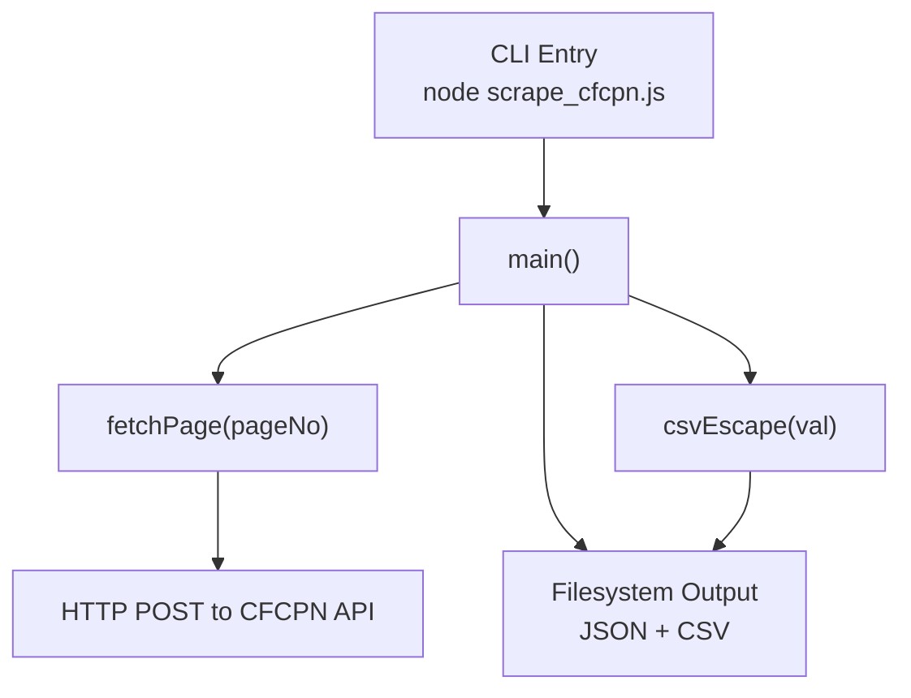
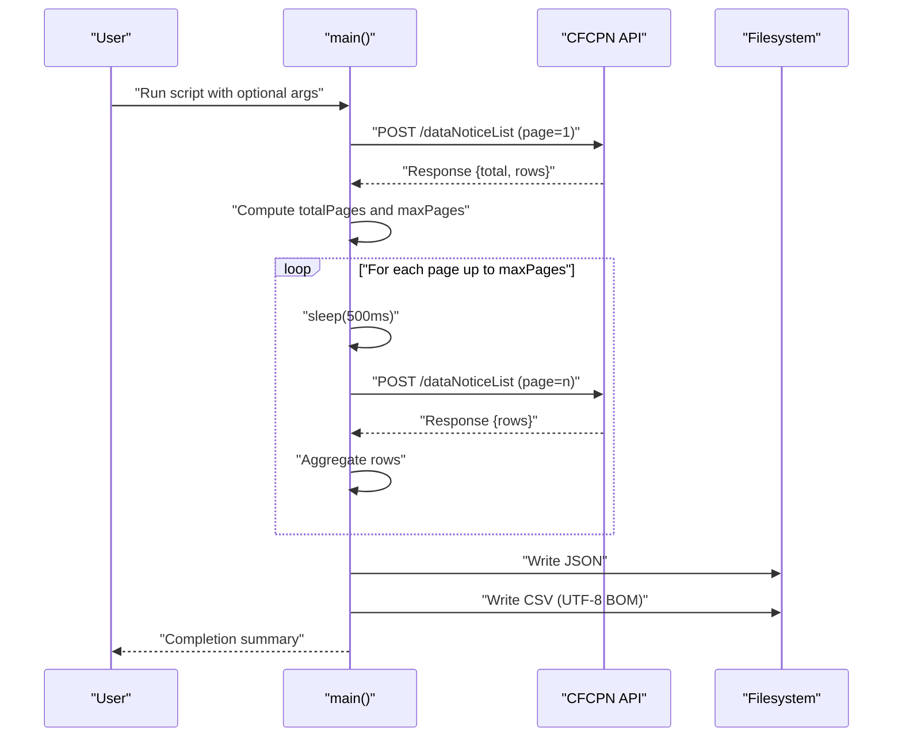
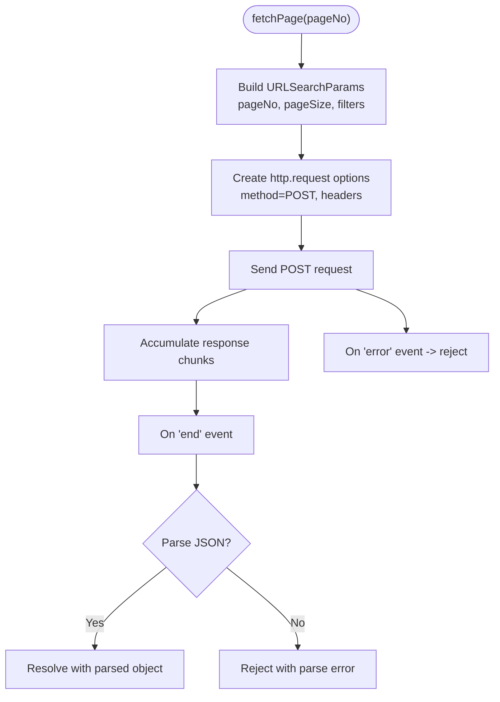
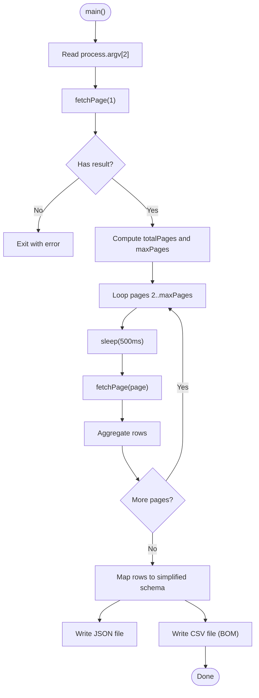
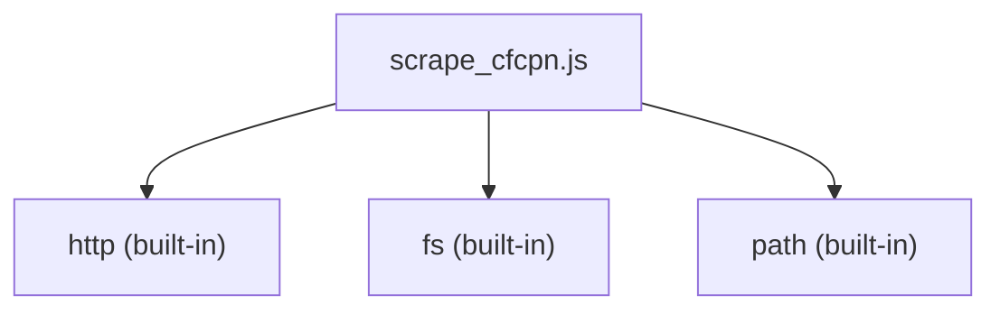

# Project Overview

<cite>
**Referenced Files in This Document**
- [scrape_cfcpn.js](file://scrape_cfcpn.js)
</cite>

## Table of Contents
1. [Introduction](#introduction)
2. [Project Structure](#project-structure)
3. [Core Components](#core-components)
4. [Architecture Overview](#architecture-overview)
5. [Detailed Component Analysis](#detailed-component-analysis)
6. [Dependency Analysis](#dependency-analysis)
7. [Performance Considerations](#performance-considerations)
8. [Troubleshooting Guide](#troubleshooting-guide)
9. [Conclusion](#conclusion)
10. [Appendices](#appendices)

## Introduction
This project is a Node.js command-line tool that automatically scrapes procurement notices from China's Government Procurement Network (金采网/CFCPN). It performs automated data collection via an HTTP API, transforms the results into structured formats, and writes outputs to JSON and CSV files. The CLI supports controlling scrape scope through simple arguments: default behavior fetches a small sample for quick testing, while advanced options allow bulk extraction across many pages.

What is procurement notice scraping?
- Procurement notices are public announcements by government agencies about upcoming purchases, tenders, or contract opportunities.
- Scraping automates the retrieval of these notices from an online portal so they can be analyzed, reported, or integrated into other systems.
- In this project, scraping targets CFCPN’s official API endpoint and converts raw responses into clean, tabular datasets suitable for Excel or further processing.

Key capabilities:
- Automated data collection using Node.js built-in modules with zero external dependencies.
- Structured output in JSON and CSV formats.
- Command-line interface to control scrape scope (default sample vs. full dataset).
- Built-in rate limiting to avoid being blocked during high-volume requests.

## Project Structure
The repository is intentionally minimal and focused on a single script that encapsulates all functionality:
- scrape_cfcpn.js: The main executable script containing HTTP request handling, pagination logic, data transformation, and file output.



**Diagram sources**
- [scrape_cfcpn.js:88-175](file://scrape_cfcpn.js#L88-L175)
- [scrape_cfcpn.js:21-71](file://scrape_cfcpn.js#L21-L71)
- [scrape_cfcpn.js:78-86](file://scrape_cfcpn.js#L78-L86)

**Section sources**
- [scrape_cfcpn.js:1-181](file://scrape_cfcpn.js#L1-L181)

## Core Components
- CLI entry point and orchestration:
  - The main function parses command-line arguments, determines how many pages to scrape, orchestrates page fetching, and writes outputs.
- HTTP client:
  - Uses Node.js http module to POST form-encoded payloads to the CFCPN API and parse JSON responses.
- Pagination and rate limiting:
  - Determines total pages based on the first response and iteratively fetches subsequent pages with a delay between requests.
- Data transformation:
  - Maps raw API rows into a simplified schema for both JSON and CSV outputs.
- CSV writer:
  - Escapes fields safely and writes UTF-8 with BOM for Excel compatibility.

Practical usage examples:
- Quick test with default parameters:
  - Run the script without arguments to fetch a small sample (default number of pages).
- Bulk data extraction:
  - Provide a numeric argument to specify the number of pages to scrape.
  - Use the special argument to request all available pages (note: large datasets may take significant time).

**Section sources**
- [scrape_cfcpn.js:88-175](file://scrape_cfcpn.js#L88-L175)
- [scrape_cfcpn.js:21-71](file://scrape_cfcpn.js#L21-L71)
- [scrape_cfcpn.js:78-86](file://scrape_cfcpn.js#L78-L86)

## Architecture Overview
High-level flow:
- The CLI reads arguments and calls main.
- main fetches the first page to determine total records and calculates target pages.
- For each page, it calls fetchPage with a delay to avoid throttling.
- Results are aggregated and transformed into a consistent structure.
- Outputs are written to JSON and CSV files in the same directory as the script.



**Diagram sources**
- [scrape_cfcpn.js:88-175](file://scrape_cfcpn.js#L88-L175)
- [scrape_cfcpn.js:21-71](file://scrape_cfcpn.js#L21-L71)

## Detailed Component Analysis

### HTTP Request Handling (fetchPage)
- Purpose:
  - Sends a POST request to the CFCPN API with form-encoded parameters including page number and size.
- Key behaviors:
  - Builds URLSearchParams with required fields such as pageNo, pageSize, column, searchType, and others.
  - Sets headers including Content-Type, Content-Length, User-Agent, and Referer.
  - Handles streaming response chunks and parses JSON; rejects on parse errors.
  - Returns a Promise resolving to parsed JSON or rejecting with an error message.



**Diagram sources**
- [scrape_cfcpn.js:21-71](file://scrape_cfcpn.js#L21-L71)

**Section sources**
- [scrape_cfcpn.js:21-71](file://scrape_cfcpn.js#L21-L71)

### Data Transformation and Output (main)
- Purpose:
  - Orchestrates scraping, aggregates results, maps fields to a simplified schema, and writes outputs.
- Key behaviors:
  - Parses CLI argument to decide maxPages; defaults to a small sample if not provided.
  - Fetches first page to get total count and compute totalPages.
  - Iteratively fetches remaining pages with a sleep delay to avoid blocking.
  - Transforms each row into a normalized structure with fields like id, title, publishTime, purchaser, method, region, category, tags, source.
  - Writes JSON with metadata (scrapeTime, total, scraped) and rows.
  - Writes CSV with header and escaped values; includes UTF-8 BOM for Excel compatibility.



**Diagram sources**
- [scrape_cfcpn.js:88-175](file://scrape_cfcpn.js#L88-L175)

**Section sources**
- [scrape_cfcpn.js:88-175](file://scrape_cfcpn.js#L88-L175)

### CSV Escaping (csvEscape)
- Purpose:
  - Ensures CSV values are properly escaped to preserve formatting when opened in spreadsheet software.
- Key behaviors:
  - Converts null/undefined to empty string.
  - Wraps values containing commas, quotes, or newlines in double quotes and escapes internal quotes by doubling them.
  - Returns unquoted strings otherwise.

```mermaid
flowchart TD
CSStart(["csvEscape(val)"]) --> NullCheck{"val == null?"}
NullCheck --> |Yes| Empty["Return ''"]
NullCheck --> |No| ToStr["Convert to String"]
ToStr --> NeedsQuote{"Contains ',', '\"', or newline?"}
NeedsQuote --> |Yes| QuoteWrap["Wrap in quotes and escape inner quotes"]
NeedsQuote --> |No| ReturnRaw["Return raw string"]
QuoteWrap --> CSEnd(["Return escaped value"])
ReturnRaw --> CSEnd
```

**Diagram sources**
- [scrape_cfcpn.js:78-86](file://scrape_cfcpn.js#L78-L86)

**Section sources**
- [scrape_cfcpn.js:78-86](file://scrape_cfcpn.js#L78-L86)

## Dependency Analysis
The project uses only Node.js built-in modules:
- http: For making HTTP POST requests to the CFCPN API.
- fs: For writing JSON and CSV files.
- path: For constructing output file paths relative to the script location.



**Diagram sources**
- [scrape_cfcpn.js:11-18](file://scrape_cfcpn.js#L11-L18)

**Section sources**
- [scrape_cfcpn.js:11-18](file://scrape_cfcpn.js#L11-L18)

## Performance Considerations
- Rate limiting:
  - A fixed delay between requests helps avoid server-side throttling or IP blocks.
- Batch size:
  - PAGE_SIZE controls how many items per page are returned; adjust carefully depending on API limits and desired throughput.
- Memory usage:
  - All rows are accumulated in memory before writing; for very large datasets, consider streaming or chunked writes.
- I/O efficiency:
  - Writing JSON and CSV once at the end reduces filesystem overhead compared to incremental writes.

[No sources needed since this section provides general guidance]

## Troubleshooting Guide
Common issues and resolutions:
- API returns no result:
  - If the first page response lacks expected fields, the script exits with an error. Verify network connectivity and API availability.
- JSON parse error:
  - If the response body is not valid JSON, the script reports a parse error including a snippet of the raw response. Inspect the raw content and ensure the API is returning the expected format.
- Request failures:
  - Network errors or timeouts will cause page fetches to fail. The script stops after encountering an error; retry later or reduce concurrency.
- CSV display issues in Excel:
  - The CSV is written with UTF-8 BOM to improve Excel compatibility. If characters still appear incorrectly, ensure your editor or Excel is set to open UTF-8 files.

Operational tips:
- Start with default parameters to validate setup quickly.
- Increase page count gradually to monitor performance and stability.
- Avoid using the “all” option unless necessary due to potentially large datasets and longer runtimes.

**Section sources**
- [scrape_cfcpn.js:96-99](file://scrape_cfcpn.js#L96-L99)
- [scrape_cfcpn.js:60-63](file://scrape_cfcpn.js#L60-L63)
- [scrape_cfcpn.js:127-130](file://scrape_cfcpn.js#L127-L130)
- [scrape_cfcpn.js:170-172](file://scrape_cfcpn.js#L170-L172)

## Conclusion
The CFCPN Procurement Notice Scraper is a lightweight, dependency-free Node.js CLI tool designed to automate the collection of procurement notices from CFCPN. It balances simplicity and robustness by leveraging built-in modules, providing clear CLI controls, and producing structured outputs in JSON and CSV. With its straightforward architecture and practical safeguards like rate limiting and CSV escaping, it serves both quick validation tasks and larger-scale data extraction needs.

[No sources needed since this section summarizes without analyzing specific files]

## Appendices

### Practical Usage Examples
- Quick test with default parameters:
  - Execute the script without arguments to fetch a small sample and verify outputs.
- Bulk data extraction:
  - Provide a numeric argument to specify the number of pages to scrape.
  - Use the special argument to request all available pages (be mindful of runtime and volume).

Output files:
- JSON: Contains metadata (scrapeTime, total, scraped) and a rows array with normalized fields.
- CSV: Header row followed by data rows; UTF-8 BOM included for Excel compatibility.

**Section sources**
- [scrape_cfcpn.js:88-175](file://scrape_cfcpn.js#L88-L175)